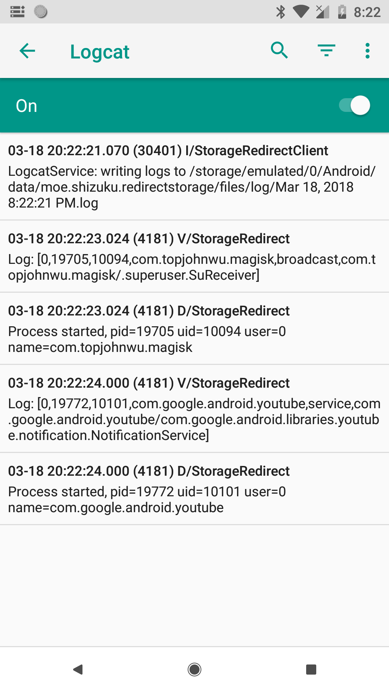
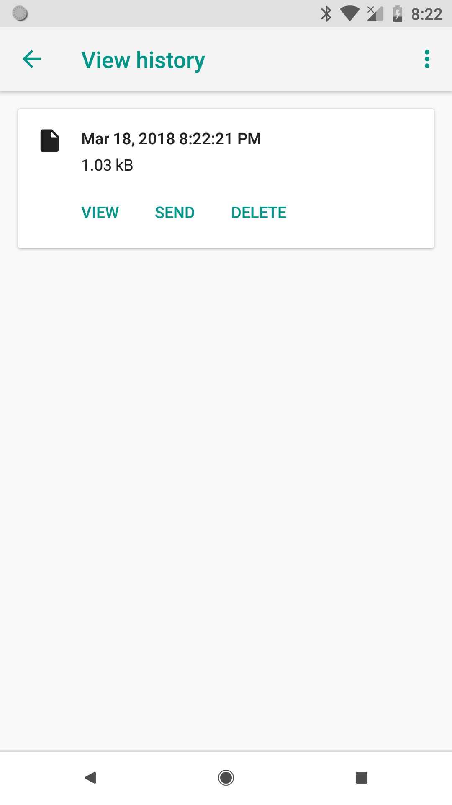

## Save logs and send them to developer

To find out problems you met in Storage Redirect, you can save debug logs and send them to developer through built-in logcat function.

### Start Logcat

First, enter Storage Redirect app and click Menu - Logcat before problems come out.

After opening Logcat UI, it will automatically start logcat service. And you just need to wait for problems.

> You can allow logcat service to start at boot, in order to record logs for earlier problem.

### Save and send

After the problem come out, you can stop logcat service. Click Menu - View history and send logs recorded at corresponding time points to developer.

