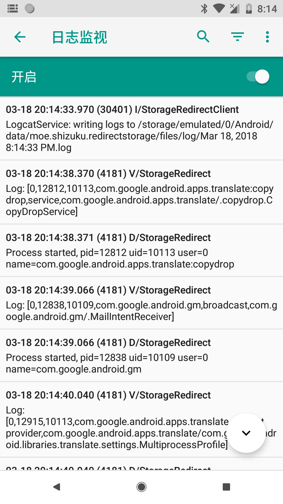
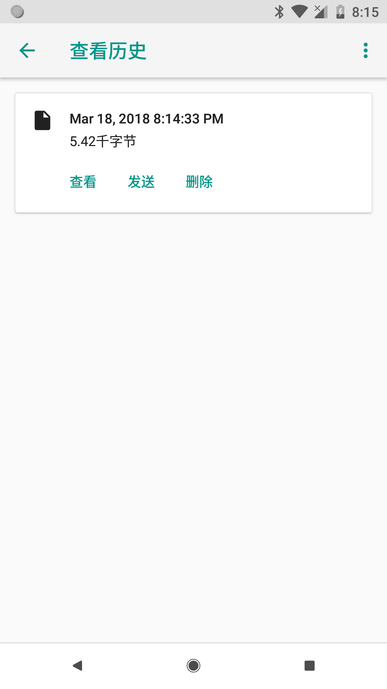

## 保存调试日志并提供给开发者

当使用 Storage Redirect 时遇到了一些问题，可以通过自带的日志监测将有用的调试日志提供给开发者，以便找到问题。

### 开始监测日志

首先，在再次复现问题前进入 Storage Redirect 界面，点击右上角更多菜单 - “日志监测”。

打开界面后会自动开启日志监测服务，这时只需让问题再次出现即可。

> 你可以让日志监测在开机完毕就立即启动，便于及时记录到较早发生的问题。

### 保存并发送

问题复现后就可以停止日志监测了，点击日志检测界面的菜单，找到历史列表，将对应时间点记录的日志发送给开发者。

