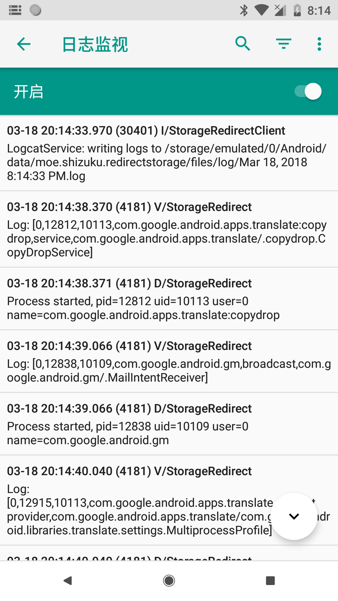
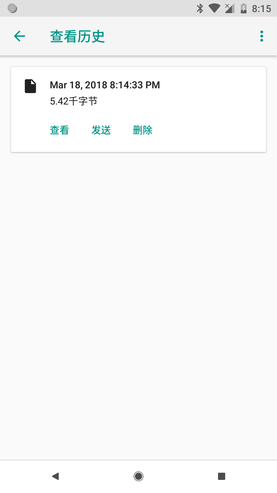

## 儲存偵錯日誌並提供給開發者

當使用 Storage Redirect 時遇到了一些問題，可以透過內建的日誌監測將有用的偵錯日誌提供給開發者，以便找到問題。

### 開始監測日誌

首先，在再次重現問題前進入 Storage Redirect 界面，輕觸右上角更多選項 - 「日誌監測」。

打開界面後會自動開啟日誌監測服務，這時只需讓問題再次出現即可。

> 你可以讓日誌監測在開機完畢就立即啟動，便於及時記錄到較早發生的問題。

### 儲存並發送

問題重現後就可以停止日誌監測了，輕觸日誌檢測界面的選單，找到歷史列表，將對應時間點記錄的日誌發送給開發者。

